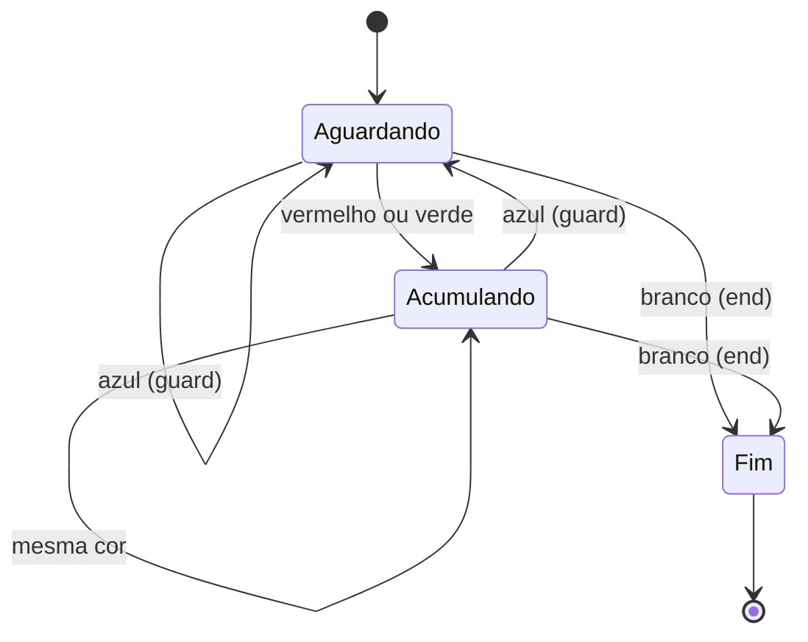
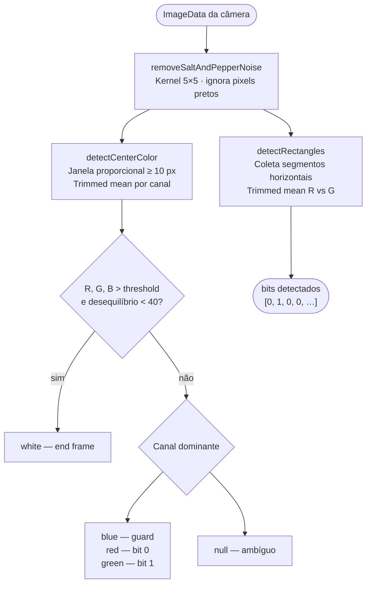
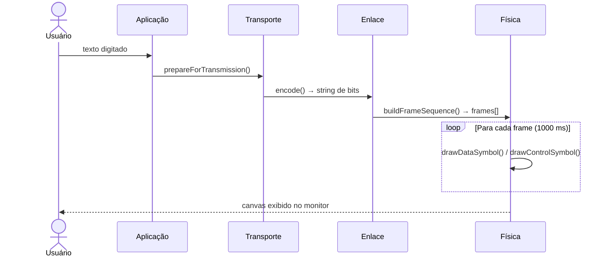
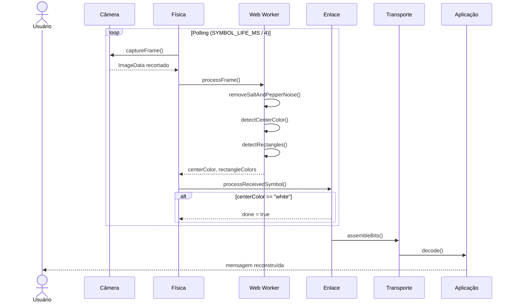

# Enlace Óptico Sem Fio (WON Prototype)


> Prototipagem de um enlace óptico sem fio utilizando um monitor como transmissor e uma câmera como receptor. O objetivo é experimentar os desafios da camada física na transmissão de dados e identificar técnicas para mitigar seus efeitos. Mais informações no relatório [Protótipo de Rede WON](./src/assets/Protótipo%20de%20Rede%20WON.pdf).

---

## Tecnologias


---

## Como Funciona

O sistema transmite mensagens de texto de um dispositivo para outro **visualmente**, usando cores exibidas na tela como canal de comunicação. O transmissor (TX) exibe sequências de quadros coloridos no monitor; o receptor (RX) captura esses quadros pela câmera e reconstrói a mensagem original.

O protocolo é organizado em **quatro camadas**, cada uma com responsabilidades bem definidas, inspiradas no modelo OSI:

```text
┌─────────────────────────────────────────────────────┐
│  Camada 4 — Aplicação   (ApplicationLayer.ts)       │
│  Prepara e formata a mensagem do usuário             │
├─────────────────────────────────────────────────────┤
│  Camada 3 — Transporte  (TransportLayer.ts)          │
│  Converte texto ↔ fluxo binário (ASCII 8 bits)       │
├─────────────────────────────────────────────────────┤
│  Camada 2 — Enlace      (LinkLayer.ts)               │
│  Divide bits em quadros com protocolo de controle    │
├─────────────────────────────────────────────────────┤
│  Camada 1 — Física      (PhysicalLayer.ts)           │
│  Renderiza quadros no canvas / captura pela câmera   │
└─────────────────────────────────────────────────────┘
```

---

## Arquitetura de Camadas

### Camada 4 — Aplicação

**Responsabilidade:** fronteira entre o usuário e o protocolo.

- **TX:** recebe o texto digitado e o repassa sem modificações para a camada de transporte.
- **RX:** aplica `trim()` na mensagem reconstruída antes de exibir ao usuário.

Esta camada é um ponto de extensão: filtros, compressão ou recodificação de caracteres (UTF-8) poderiam ser adicionados aqui sem alterar as camadas inferiores.

---

### Camada 3 — Transporte

**Responsabilidade:** representar a mensagem como um fluxo de bits.

**Codificação (TX):**

Cada caractere é convertido para seu código ASCII e representado em 8 bits:

```text
"A"  →  65  →  "01000001"
"AB" →  "0100000101000010"
```

**Decodificação (RX):**

O fluxo binário é fatiado em grupos de 8 bits; cada grupo é interpretado como um código ASCII:

```text
"01000001 01000010" → [65, 66] → "AB"
```

Grupos com menos de 8 bits são descartados (bits perdidos na transmissão).

---

### Camada 2 — Enlace

**Responsabilidade:** estruturar o fluxo de bits em quadros e controlar a sincronização.

#### Tipos de Quadro

| Tipo    | Cor              | Hex       | Propósito                        |
|---------|------------------|-----------|----------------------------------|
| `data`  | Vermelho / Verde | —         | Carrega bits de dados            |
| `guard` | Azul             | `#0000FF` | Separador entre quadros de dados |
| `end`   | Branco           | `#ffffff` | Sinaliza fim da transmissão      |
| `sync`  | Azul             | `#0000FF` | Inicialização da sincronização   |

#### Protocolo de Transmissão (TX)

O fluxo de bits é dividido em grupos de N bits (definido pela modulação) e encapsulado na seguinte sequência única — a transmissão ocorre uma única vez, sem repetição:

```text
[sync] [guard] [data₁] [guard] [data₂] [guard] ... [dataN] [end]
```

Cada quadro é exibido por **1000 ms** no monitor.

Exemplo para a mensagem `"Hi"` com modulação de 4 bits/símbolo:

```text
bits:     0 1 0 0 1 0 0 0 0 1 1 0 1 0 0 0
frames:   [0100] guard [1000] guard [0110] guard [1000] end
```

#### Máquina de Estados do Receptor (RX)



Essa lógica garante que cada quadro de dados seja lido **exatamente uma vez**, mesmo que a câmera capture múltiplos frames do mesmo símbolo.

---

### Camada 1 — Física

**Responsabilidade:** converter quadros em imagens visuais (TX) e processar os frames da câmera (RX).

#### Representação dos Bits

Cada bit é representado por uma cor sólida em um retângulo na tela:

| Bit | Cor      | Hex       |
|-----|----------|-----------|
| `0` | Vermelho | `#FF0000` |
| `1` | Verde    | `#00FF00` |

#### Modulação

A modulação define quantos bits são transmitidos por símbolo (quadro de dados), organizando o canvas em uma grade N×N:

| Modulação | Grade  | Bits/símbolo |
|-----------|--------|--------------|
| 1         | 1×1    | 1            |
| 2         | 1×2    | 2            |
| 4         | 2×2    | 4            |
| 9         | 3×3    | 9            |
| 16        | 4×4    | 16           |

Uma **borda de guarda de 35 px** em torno de toda a grade serve como margem de segurança para o processamento de imagem no receptor.

#### Captura e Processamento (RX)

A cada ciclo de captura, o `ImageData` recortado é enviado ao Web Worker para processamento sem bloquear a UI:



---

## Ruído Sal e Pimenta — Problema e Solução

### O Problema

Em sistemas de transmissão óptica, o sensor da câmera introduz **ruído de impulso** (salt-and-pepper): pixels aleatórios aparecem com valores extremos (branco puro ou preto puro) independentemente da cor real da cena. Esse ruído prejudica a detecção das cores e pode causar erros na leitura dos bits.

```text
Pixel real:    R=0,   G=200, B=0   (verde → bit 1 ✓)
Pixel ruidoso: R=255, G=255, B=255 (branco → "end" ✗)
```

### A Solução: Filtro de Mediana Seletivo

O projeto implementa um **filtro de mediana** no Web Worker (`src/workers/pixelProcessor.worker.ts`).

**Algoritmo:**

Para cada pixel **não-preto** da imagem, o filtro:

1. Coleta os valores RGB dos vizinhos em uma janela de **5×5 pixels**, **excluindo vizinhos pretos** (bordas de guarda).
2. Ordena os valores de cada canal separadamente.
3. Substitui o valor do pixel pelo **valor mediano** da janela.

Pixels com R, G e B abaixo de `COLOR_THRESHOLD` são considerados bordas de guarda e copiados sem alteração — preservando os marcadores de separação entre retângulos e evitando que contaminem a mediana dos pixels de informação adjacentes.

```text
Vizinhança 5×5 do canal Verde (valores ordenados, pretos excluídos):
[185, 190, 195, 198, 200, 200, 201, 202, 203, 205, 207, 210, 212]
                              ↑ mediana ≈ 201  (ruído removido)
```

**Por que o filtro de mediana funciona:**

- O ruído "sal" (255) se posiciona nas extremidades da lista ordenada e é excluído.
- O ruído "pimenta" (0) também se posiciona nas extremidades e é excluído.
- O sinal verdadeiro (valores intermediários) domina a mediana e é preservado.
- Diferentemente do filtro de média, a mediana **não borra as bordas** entre regiões de cores diferentes.

### Detecção Robusta de Cor

Além do filtro de mediana, o pipeline de detecção utiliza **média aparada (trimmed mean)** para calcular a cor representativa de cada região, descartando os 10% de valores mais altos e mais baixos antes de calcular a média. Isso elimina pixels outliers remanescentes sem descartar a amostra inteira.

A detecção de branco (`end frame`) exige que todos os canais estejam acima do threshold **e** que o desequilíbrio entre canais seja menor que 40 — evitando que cores sobreexpostas (ex.: vermelho brilhante R=255, G=200, B=200) sejam confundidas com branco.

**Configuração atual:**

| Parâmetro           | Valor | Descrição                                        |
|---------------------|-------|--------------------------------------------------|
| `KERNEL_SIZE`       | 4     | Janela 5×5 centrada (half = 2)                   |
| `COLOR_THRESHOLD`   | 125   | Limiar de canal para "cor ativa" / "pixel preto" |
| `PRE_PROCESS`       | true  | Filtro mediana sempre habilitado                 |
| Trim (trimmedMean)  | 10%   | Fração descartada de cada extremidade            |
| Balanço branco      | < 40  | Desequilíbrio máximo entre canais para "white"   |

---

## Fluxo Completo de Dados

### Transmissão (TX)



### Recepção (RX)



---

## Pré-requisitos

- [`Git`](https://git-scm.com/)
- [`Node.js 18+`](https://nodejs.org/)

## Instalação

```bash
git clone https://github.com/pumba-dev/wireless-optical-network-prototype.git
cd wireless-optical-network-prototype
npm install
```

## Executando

```bash
npm run dev
```

---

## Contribuindo

1. Faça um fork do repositório.
2. Crie uma branch: `git checkout -b minha-feature`.
3. Faça suas alterações e commit: `git commit -m 'feat: minha feature'`.
4. Envie para o fork: `git push origin minha-feature`.
5. Abra um Pull Request.

---

## Colaboradores

[](https://github.com/pumba-dev)

**[Pumba Dev](https://github.com/pumba-dev)**

## Doações

[](https://picpay.me/pumbadev)
[](https://nubank.com.br/pagar/1ou9f/ifu2K7YNO7)

## Licença

Copyright © 2024 Pumba Developer

[⬆ Voltar ao topo](#enlace-óptico-sem-fio-won-prototype)
